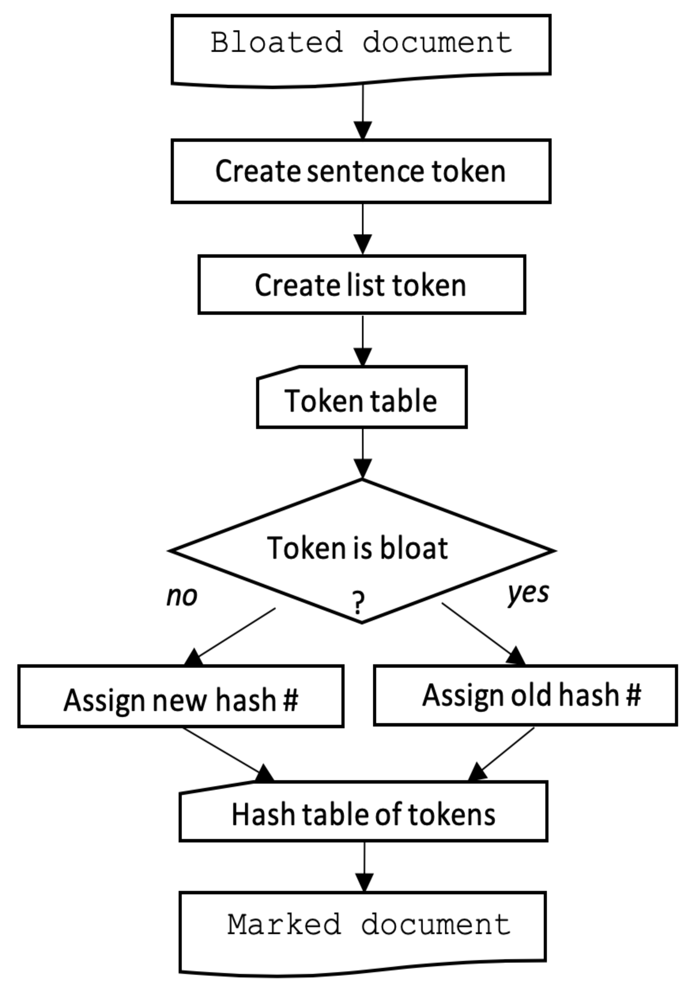
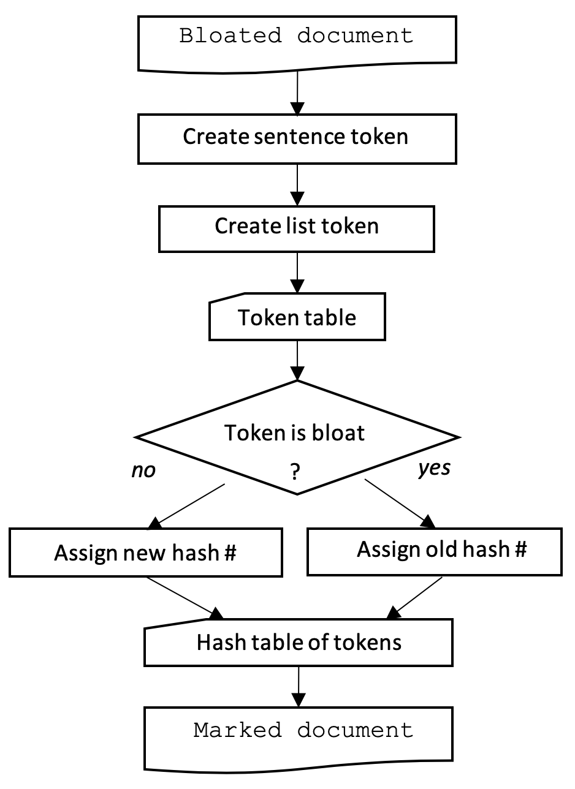

---
title: 'Bloatectomy: A python package for the identification and removal of duplicate text in the bloated notes of electronic health records and other documents'
tags:
  - python
  - medical informatics
  - electronic health records
  - electronic medical records
  - public health informatics
  - clinical information extraction
  - health informatics
  - natural language processing
authors:
  -  name: Summer K. Rankin*
     orcid: 0000-0002-6886-3983
     affiliation: "1"
  -  name: Roselie Bright
     orcid: 0000-0002-7565-1284
     affiliation: "2"
  -  name: Katherine Dowdy
     affiliation: "1"
affiliations:
 - name: Booz Allen Hamilton, McLean, VA, USA
   index: "1"
 - name: Office of Health Informatics, Office of the Chief Scientist, Office of the Commissioner, U.S. Food and Drug Administration, 10903 New Hampshire Avenue, Silver Spring, MD, USA 20993-0002 roselie.bright@fda.hhs.gov.
   index: "2"
date: 1 June 2020
bibliography: paper.bib
---  
url: https://github.com/MIT-LCP/bloatectomy
*corresponding author
The authors are listed in order of contributions to the work and manuscript.


# Summary
Duplicated sentences (“note bloat”) in unstructured electronic healthcare records hamper scientific research. Existing methods did not meet our needs. We adapted the LZW compression algorithm into a new method and designed parameters to allow customization for varying data and research needs. This resulted in the Bloatectomy package which identifies duplicate sentences in unstructured healthcare notes (or other documents), marks them for manual review, and removes them for statistical analysis. The package allows for a high level of customization in the length and type of duplications (via regular expressions) and could also be used for plagiarism detection or other text pre-processing requirements for natural language processing (NLP). The Bloatectomy method works, is available for use, and can be adapted for other settings.



# Introduction
The authors are part of a team that is using the text notes in electronic healthcare records (EHRs). Our EHRs are a de-identified hospital critical care data set known as the Medical Information Mart for Intensive Care (MIMIC-III)[@mimiciii; @mimiciiidata; @physionet].

Most notes were made by physicians (attending, radiology, consulting) and CCU nurses. Most of these notes included sections that were duplicates of earlier notes (written by themselves or another provider) for the same patient’s hospitalization (their admission). Sometimes pasted sections were edited, and then the modified text was duplicated into later notes (see \autoref{notes1} and \autoref{notes2}).


This type of duplication has been noticed in other health care settings [reviewed in @Dean:2018]. The duplications distort statistical analyses of terms used and hamper manual review of the notes for changes in patient care and status. Removing these duplicated notes allows us to use a wide variety of statistical methods without concern for the weights introduced by duplicates.

For example, if we are using a simple frequency (count) vectorization method, the more times a word appears, the more important it is in the analysis. Furthermore, as length of stay increases, the burden of duplicates also increases, which inflates the importance of, for example, admission comments. Artificial repeats (copies) of text will artificially inflate the importance of the repeated words or phrases [@Cohen:2013]. Though existing methods can weight words (i.e., term-frequency x inverse document frequency [TF-IDF]), for this dataset these methods did not yield satisfactory results.

Our goal was to identify duplicated sections to aid manual review and to delete them from statistical processes. We developed criteria for the tool that were based on the clinical setting and our desire to keep all new clinical information. Specifically:

1.	Minimum clinical concepts were at the sentence or partial or complete list level.  Minor changes within a sentence or list could change the clinical meaning; for example, insertion of the word “not” reverses the meaning of a sentence. We wanted a tool that would find exact duplicate sentences and lists.
2.	Duplications could occur as an entire note or partial note. We wanted to find both partial and entire duplicates of notes.
3.	Duplications from more than one original source could occur in a single note, and we wanted to find all of them.
4.	Exact or partial duplications could occur across many notes, and we wanted to find all of them.
5.	Lists of clinical parameters and values could be completely or partially duplicated across notes. In addition to finding duplicates of entire lists, we wanted to find duplicates of significantly long sections of lists in the notes.
6.	Document structure (headings, paragraph formats, list formats) of notes varied widely. We needed a method with broad independence of the internal structures.
7.	We wanted the method to be simple and user-friendly if doing so resulted in an acceptably low level of error.
8.	We wanted to be able to use the output for two purposes:
    a.	Aid manual review of notes by marking the duplicate sections
    b.	Statistical analyses


We evaluated existing available tools and strategies.
- Plagiarism tools typically compare documents and stop after finding the first instance of duplicate text [@Su:2008; @copyfind; @Ceglarek:2013]; some also appropriately account for paraphrasing. Some other duplication detection methods [@Thielke:2007; @Wrenn:2010] rely on the Bloomfield plagiarism tool. We focused on concepts at the sentence level because word meaning depends on its immediate sentence and paragraph, regardless of where it appears in the note. Genetic and protein sequence comparators also finish after finding similar sequences [@Altschul:1990]. We wanted to find exact duplicates and every instance of them.
- Some existing EHR deduplication methods have been applied only to the discharge note [@Cohen:2013]. Unfortunately, the discharge notes in MIMIC III are not comprehensive accounts of all observations and treatments that may be key to specific research questions; for example, blood transfusions are sometimes noted in coded data or nursing notes yet were absent from the discharge summary.
- Fingerprinting identifies redundant entire notes based on similarity [@Cohen:2013], but it finds inexact duplicates (which could be clinically different in some way). Also, we wanted to identify duplicate concepts within notes even if some other parts of the note were original.
- Clustering entire notes, and then looking for entire and near duplicate pairs of notes within clusters [@Gabriel:2018] works only on entire notes. We wanted to detect duplicate sentences and lists within notes, even if new material existed among the duplicates.
- Detecting duplicates through topic modeling, an unsupervised and unreplicable [@Lancichinetti:2015] method of clustering related words and expressions within documents, [@Cohen:2014] involved comparing two simplifications that did not fit our needs
    - Selection and use of a best note within the admission. We found that crucial clinical information was missing from any one best note in an admission.
    - Selection of the one source note, the longest one, in the admission.  We found that in MIMIC III, there is no single source note in an admission.
- Sliding windows [@Zhang:2011], similar to frameshifting in other fields, were a possibility if we adapted them to sentences and lists. We believe our method is simpler to implement.


The LZW compression algorithm [@Welch:1984] hashes words by assigning sequential numeric addresses to them. Any word that has been hashed before is assigned the original numeric address. We adapted the method to sentences rather than words because the altered sentences in pasted text also had new meanings. The hashing system allowed us to both highlight pasted sentences in text documents and remove the duplicate sentences during preprocessing for statistical analysis.

# Duplicate Detection


## Document Selection
In Natural Language Processing (NLP), we refer to a unit of text as a document. In the MIMIC-III database, free-text notes from multiple sources are associated with a patient's admission (HADM_ID). For our analysis, a document consisted of the concatenation of all notes for an admission into one single document in chronological order. Thus, there is one document per admission.

## Code and Example
The Bloatectomy (v.2.1) tool can be found in the python package ``bloatectomy.py``. The MIMIC-III database was stored in a PostgreSQL (v.9.4) database. The Bloatectomy tool was written using only Python 3 (v.3.7.3) [@python3]. No other libraries are needed to identify duplicate text. An option to ingest or output a word document requires the python-docx library.
The Bloatectomy method is as follows:
1.	Create sentence tokens.
2.	Create list tokens.
3.	Assign either new or old hash number.
4.	Use the hash table of tokens to:
    - Mark duplicate tokens in a recreated document for manual review.
    - Create a string from the unduplicated tokens for statistical analysis.

### Create Sentence Tokens
First, we tokenized (separated) an admission's concatenated notes (a single document) based on the presence of:
- a period ( . ) followed by one or more
    white space characters (space, tab, line breaks) or a
    line feed character (\n).  

An example of the text seen in an EHR looks like the following:
```No CP. Became tachycardic to 160s on dopa. No CP.
Tmax: 36.6
C (97.8
HR: 100 (97 - 166) bpm
Tmax: 36.6
C (97.8
```

The plain text—i.e., only the characters used to represent the text—looks like the following:
```
No CP. Became tachycardic to 160s on dopa. No CP.\nTmax: 36.6\nC (97.8\nHR: 100 (97 - 166) bpm\nTmax: 36.6\nC (97.8
```
The first tokenization was accomplished using a regular expression \autoref{regex1} in python (v.3.7.3) using the `re` (regular expression) library. This regular expression can be changed by passing any valid regular expression for the `regex1` parameter.


At this point, we have two tokens because there are two periods followed by a line feed character.

| Token Number    | Token     |
| :------------- | :------------- |
| 1       | No CP.       |
| 2       |Became tachycardic to 160s on dopa. |
| 3 | No CP.       |
|4 | \nTmax: 36.6\nC (97.8\nHR: 100 (97 - 166) bpm\nTmax: 36.6\nC (97.8 |


### Create List Token
Next, each token is examined and split again if it contains a line feed character followed by one or more:
- Upper case character
- Digit
- En dash (-)
- Number sign (#)  

Using our sample text, token 4 is split into several new tokens, which are then inserted into our token list. If a token does not need to be split further, it is added to our list as-is. The regular expression for the split described in \autoref{regex2}. This regular expression can be changed by passing any valid regular expression for the `regex2` parameter.


After the token has been split, the text is cleaned up to increase the matches and focus on the text rather than the formatting. All line feed characters are replaced with one white space. White spaces at the beginning and end of a token are removed, then the token is added to the new token list.

```
# replace \n with a space with a space
sent_token = [re.sub(r"$\n+","",i) for i in sent_token] # remove from end
sent_token = [re.sub(r"^\n", "", i) for i in sent_token] #remove from front

# line feeds + whitespace or not
sent_token = [re.sub(r"\s+\n\s+", " ", i) for i in sent_token]
sent_token = [re.sub(r"\s+\n", " ", i) for i in sent_token]
sent_token = [re.sub(r"\n\s+", " ", i) for i in sent_token]
sent_token = [re.sub(r"\n", " ", i) for i in sent_token]

#remove front/end whitespace
sent_token = [i.strip(' ') for i in sent_token]
```

Specifically, token 4 becomes 5 new tokens:


| Token Number    | Token     |
| :------------- | :------------- |
| 1       | No CP.       |
| 2       |Became tachycardic to 160s on dopa. |
| 3 | No CP.       |
|4 | Tmax: 36.6 |
| 5 | C (97.8 |
|6 | HR: 100 (97 - 166) bpm |
|7 | Tmax: 36.6 |
|8 | C (97.8 |


### Assign Either New or Old Hash Number
Next, we create a dynamic set structure that accepts tokens one at a time. The function is a generator that yields one token at a time; when the output is stored as a list, the original order of tokens is maintained while providing the flexibility to either remove or mark (highlight, bold) a duplicate token.
As each token is passed through the loop, one of two outcomes will result:
1.	If the token is not in the dynamic set, it will be added to the set, and the token is yielded as-is.
2.	If the token is already contained in the set, it is NOT added to the set; HTML tags are added to the token, yielding a marked token. If we want to remove the token, nothing is yielded at this step.

```
tokens_set = set()
tokens_set_add = tokens_set.add

for token in input_tokens:

  if token == '':
    pass

  elif token not in tokens_set:
    tokens_set_add(token)
    yield token

  elif remov == False:
    yield tag + token + tag_end

  elif remov == True:
    pass
```
The token table essentially becomes the following hash table of tokens:

| Token Number    | Token     | Bloat | Hash # |
| :------------- | :------------- |:------------- |:------------- |
| 1       | No CP.       | No | 1 |
| 2       |Became tachycardic to 160s on dopa. | No | 2|
| 3 | No CP.       | Yes | 1|
|4 | Tmax: 36.6 | No | 3|
| 5 | C (97.8 | No | 4 |
|6 | HR: 100 (97 - 166) bpm | No | 5 |
|7 | Tmax: 36.6 | Yes | 3 |
|8 | C (97.8 | Yes | 4 |


### Use the Hash Table of Tokens
The output is a document with a list of our original tokens with highlight formatting marks around the duplicates. The user can choose to highlight, bold, or remove duplicates by setting the ``style`` argument.

```
import bloatectomy from bloatectomy
bloatectomy(text, style='highlight'))
```

| Token Number    | Token     |
| :------------- | :------------- |
| 1       | No CP.       |
| 2       |Became tachycardic to 160s on dopa. |
|  duplicate | <mark>No CP.</mark>       |
|4 | Tmax: 36.6 |
| 5 | C (97.8 |
|6 | HR: 100 (97 - 166) bpm |
|duplicate | <mark>Tmax: 36.6</mark> |
|duplicate | <mark>C (97.8</mark> |

Last, we concatenate this marked (or de-duplicated) set of tokens together to create a document of original sentences. A line feed is placed between each token for ease of viewing (due to removing the line feed characters at the beginning and end of each token). How this is executed depends on the type of output (e.g., docx, HTML).
```
uniq = str("\n".join(text))
```
The final output contains three highlighted duplicate tokens:


The marked text can be deleted for statistical analyses.
```
bloatectomy(text, style='remov'))
```

## Parameter Adjustments
We incorporated parameters that users can set to fit the features of the documents they are using. The following input types can be used:
1.	Plain text files (.txt, .rtf)
2.	Word documents (.docx)
3.	A variable containing a string of raw text
4.	A list of HADM_ID values for a PostgreSQL database (specific to MIMIC III database)

The following output types are available:
1.	HTML file (.html)
2.	Word document (.docx)
3.	Print the text to the console
4.	Numbered tokens from original (raw) text (.txt)
5.	Numbered tokens after duplication detection (.txt)  

The duplicates can be marked using:
1. highlighting
2. bold
3. remove


# Results
\autoref{output_notes1} and \autoref{output_notes2} show the sample nurse’s and physicians’ notes after Bloatectomy.


We note that Bloatectomy doesn’t exactly replicate manual evaluation of duplications.   

# Conclusions
We accepted some error in favor of simplicity and our reluctance to over-customize the algorithm. We favored leaving in duplicates over marking new information because of our research goals. Other users will find the amount of error, of either type, depends on the software parameters and the data. At least some manual review of their data will help users choose their own balance of types of errors to accept, depending on their goals.  

Bloatectomy is an effective tool for identifying duplicate text in EHRs and would be useful for other types of documents with multiple instances of duplicate sentences or paragraphs.

# Summary
Duplicated sentences (“note bloat”) in unstructured electronic healthcare records hamper scientific research.  
Existing methods did not meet our needs.  
We adapted the LZW compression algorithm into a new method and designed parameters to allow customization for varying data and research needs.  
The Bloatectomy method works, is available for use, and can be adapted for other settings.  

# Sample Text
To run bloatectomy on the sample text, use this in python 3.7.x or higher

```
from bloatectomy import bloatectomy

bloatectomy('sample_text.txt',
             filename='sampletxt_output',
             display=False,
             style='highlight',
             output='html',
             output_numbered_tokens=True,
             output_original_tokens=True )
```
This takes in the single text file (i.e., sample_text.txt) to be marked for duplicates. The marked output, original numbered tokens and marked numbered tokens can be output. Note that the tokens in the two numbered token files will have the same token numbers unless style='remov'.

## Parameters  
```
class bloatectomy(input_text,
                  path = '',
                  filename='bloatectomized_file',
                  display=False,
                  style='highlight',
                  output='html',
                  output_numbered_tokens=False,
                  output_original_tokens=False,
                  regex1=r"(.+?\.[\s\n]+)",
                  regex2=r"(?=\n\s*[A-Z1-9#-]+.*)",
                  postgres_engine=None,
                  postgres_table=None)
```

**input_text**: file, str, list  
An input document (.txt, .rtf, .docx), a string of text, or list of hadm_ids for postgres mimiciii database or the raw text.

**style**: str, optional, default=`highlight`  
Method for denoting a duplicate. The following are allowed: `highlight`, `bold`, `remov`.

**filename**: str, optional, default=`bloatectomized_file`
A string to name output file of the bloat-ectomized document.

**path**: str, optional, default=`' '`  
The directory for output files.

**output_numbered_tokens**: bool, optional, default=`False`  
If set to `True`, a .txt file with each token enumerated and marked for duplication, is output as `[filename]_token_numbers.txt`. This is useful when diagnosing your own regular expression for tokenization or testing the `remov` option for **style**.

**output_original_tokens**: bool, optional, default=`False`  
If set to  `True`, a .txt file with each original (non-marked) token enumerated but not marked for duplication, is output as `[filename]_original_token_numbers.txt`.

**display**: bool, optional, default=`False`  
If set to `True`, the bloatectomized text will display in the console on completion.

**regex1**: str, optional, default=`r"(.+?\.[\s\n]+)"`  
The regular expression for the first tokenization. Split on a period (.) followed by one or more white space characters (space, tab, line breaks) or a line feed character (\n). This can be replaced with any valid regular expression to change the way tokens are created.

**regex2**: str, optional, default=`r"(?=\n\s*[A-Z1-9#-]+.*)"`  
The regular expression for the second tokenization. Split on any newline character (\n) followed by an uppercase letter, a number, or a dash. This can be replaced with any valid regular expression to change how sub-tokens are created.

**postgres_engine**: str, optional
The postgres connection. Only relevant for use with the MIMIC III dataset. See the jupyter notebook [mimic_bloatectomy_example](../bloatectomy_examples/mimic_ bloatectomy_example.ipynb).

**postgres_table**: str, optional
The name of the postgres table containing the concatenated notes. Only relevant for use with the MIMIC III dataset.


# Acknowledgements
The authors thank Walter G. Bright, originator of the D language (WalterBright.com), for suggesting the LZW algorithm. Serge Blok, PhD, of Booz Allen Hamilton, offered the name Bloatectomy and reviewed the draft manuscript. Daily project support was provided by George Plopper, PhD, and Lauren Neal, PhD at Booz Allen Hamilton, and Letria Hall and Elaine Johanson at FDA. Susan Bright, DVM, MPH, and Lee Anne Palmer, VMD, MPH, both in the Office of Surveillance and Compliance, Center for Veterinary Medicine, FDA, participated in establishing the need to identify and remove duplicate text.

# Funding
This work was supported by the FDA Shakespeare Electronic Health Records (EHR) Text Mining Project HHSF223201510027B.

# Conflicts of Interest
The authors have declared that no competing interests exist.

# Disclaimer
The statements made in this article are not necessarily the official policy of the Food and Drug Administration.

# Data
All data for the development of this tool are located at the MIMIC-III website https://mimic.physionet.org. The code is located at https://github.com/MIT-LCP/bloatectomy

# References
